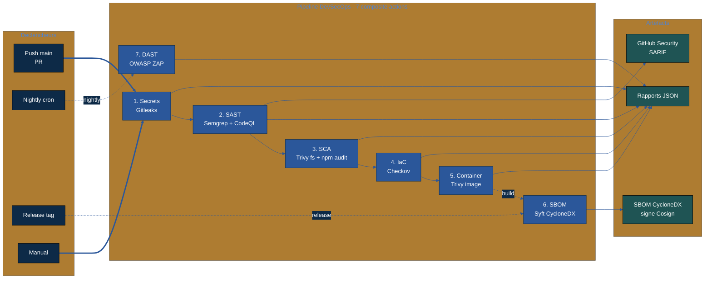

# Diagrammes

Ce dossier contient les diagrammes Mermaid du projet. Chaque diagramme est
versionne dans son fichier `.mmd` et embarque ci-dessous en rendu inline pour
visualisation directe sur GitHub.

## Pipeline DevSecOps

Architecture des 7 composite actions, leurs declencheurs et leurs artefacts.

## Legende

- Bleu marine fonce : declencheurs (push, PR, cron, release, manual)
- Bleu brand : composite actions, executees en ordre dans le workflow
- Teal fonce : artefacts produits (rapports, SARIF, SBOM)
- Trait plein : flux principal sur push/PR
- Trait pointille : flux conditionnels (nightly, release, build)

## Fichiers source

- [pipeline.mmd](pipeline.mmd) : source Mermaid editable
